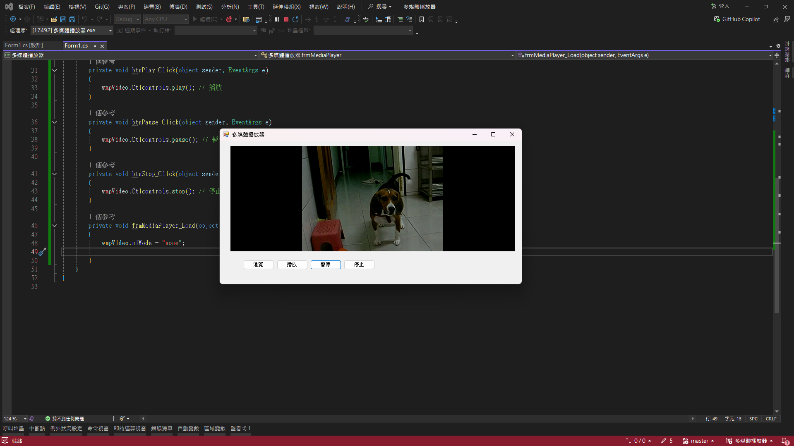

# 多媒體播放器 (Media Player)

## 專案簡介
本專案為視窗程式設計 (II) 的上課練習，使用 C# WinForms 結合 COM 元件 `Windows Media Player` (`wmp.dll`)，實作一個可自訂操作介面的影音播放軟體。

## 系統需求
- 開發環境：Visual Studio (Windows Forms .NET Framework)
- 支援格式：支援系統內建解碼器可播放之格式 (如 `.mp4`, `.wmv`, `.avi` 等)。

## 功能說明
- **影音載入**：透過 `OpenFileDialog` 選擇本機的影片檔案，並支援副檔名過濾功能。
- **自訂控制面板**：
  - 將播放器控制項的 `uiMode` 設為 `none` 以隱藏預設介面。
  - 實作自訂按鈕來呼叫 `Ctlcontrols` 進行 **播放 (play)**、**暫停 (pause)** 與 **停止 (stop)** 操作。

## 執行截圖
